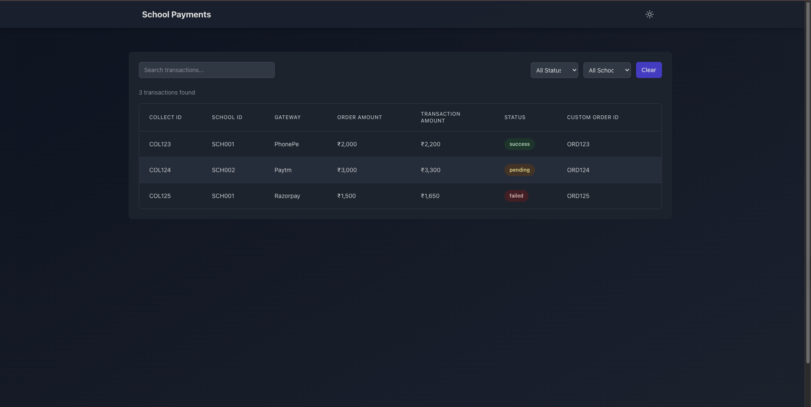

# School Payments Dashboard

A modern, responsive dashboard for managing school payment transactions with real-time updates and dark mode support.

## Features

- 📊 Transaction Management
  - View all transactions in a sortable table
  - Filter transactions by status and school
  - Real-time updates
  - Detailed transaction information

- 🎨 Modern UI
  - Clean and intuitive interface
  - Dark/Light mode support
  - Responsive design
  - Smooth animations and transitions

- 🔒 Secure & Reliable
  - JWT authentication
  - Secure API endpoints
  - Error handling
  - Loading states

## Tech Stack

- **Frontend**
  - React.js
  - TypeScript
  - Tailwind CSS
  - Vite
  - React Query
  - React Router

- **Backend**
  - Node.js
  - Express
  - MongoDB
  - JWT Authentication

## Prerequisites

- Node.js (v16 or higher)
- npm or yarn
- MongoDB Atlas account
- Git

## Installation

1. Clone the repository:
   ```bash
   git clone https://github.com/nikita2003329/school-payments-frontend.git
   cd school-payments-frontend
   ```

2. Install dependencies:
   ```bash
   npm install
   # or
   yarn install
   ```

3. Create a `.env` file in the frontend directory:
   ```env
   VITE_API_URL=http://localhost:3000
   ```

4. Start the development server:
   ```bash
   npm run dev
   # or
   yarn dev
   ```

## Project Structure

```
frontend/
├── src/
│   ├── components/     # Reusable UI components
│   ├── pages/         # Page components
│   ├── context/       # React context providers
│   ├── config/        # Configuration files
│   ├── types/         # TypeScript type definitions
│   └── App.tsx        # Main application component
├── public/            # Static assets
└── package.json       # Project dependencies
```

## Pages & Features

### Transactions Page
- Displays all transactions in a sortable table
  - Sort by date, amount, status, or school
  - Pagination support
  - Real-time updates
- Advanced filtering capabilities
  - Filter by status (Success, Pending, Failed)
  - Filter by school
  - Search across all fields
- Dark/Light mode support
- Responsive design for all devices
- Export functionality (coming soon)

### School Transactions Page
- School-specific transaction view
- Advanced filtering options
  - Date range selection
  - Status filters
  - Amount range
- Data visualization
  - Transaction trends
  - Payment statistics
- Export functionality
  - CSV export
  - PDF reports

### Transaction Status Page
- Detailed transaction information
  - Transaction ID
  - Payment details
  - School information
  - Timestamps
- Status tracking
  - Real-time status updates
  - Status history
- Receipt generation
  - Printable receipts
  - Email receipt option
- Error handling and retry options

### Authentication & Security
- JWT-based authentication
- Role-based access control
- Secure session management
- Password encryption
- Rate limiting
- CSRF protection

### API Documentation

#### Authentication API
- `POST /auth/login` - User login
- `POST /auth/refresh` - Refresh token
- `POST /auth/logout` - User logout

#### Transactions API
- `GET /transactions` - Get all transactions
  - Query parameters:
    - `page`: Page number
    - `limit`: Items per page
    - `status`: Filter by status
    - `school`: Filter by school
    - `search`: Search query
- `GET /transactions/school/:schoolId` - Get transactions by school
- `GET /transaction-status/:customOrderId` - Get transaction status
- `POST /transactions/export` - Export transactions

#### Error Responses
- `400 Bad Request` - Invalid parameters
- `401 Unauthorized` - Invalid or expired token
- `403 Forbidden` - Insufficient permissions
- `404 Not Found` - Resource not found
- `500 Internal Server Error` - Server error

## Development Guidelines

### Code Style
- Follow TypeScript best practices
- Use ESLint and Prettier for code formatting
- Write meaningful commit messages
- Document complex functions

### Testing
- Unit tests for components
- Integration tests for API calls
- End-to-end tests for critical flows
- Test coverage reports

### Performance Optimization
- Code splitting
- Lazy loading
- Image optimization
- Caching strategies

### Security Considerations
- Input validation
- XSS prevention
- CSRF protection
- Secure headers
- Regular dependency updates

## Troubleshooting

### Common Issues
1. **Authentication Issues**
   - Clear browser cache and cookies
   - Check token expiration
   - Verify credentials

2. **API Connection Problems**
   - Check network connectivity
   - Verify API URL configuration
   - Check CORS settings

3. **Build Errors**
   - Clear node_modules and reinstall
   - Check TypeScript version
   - Verify environment variables

### Support
- Create an issue on GitHub
- Check the documentation
- Contact the development team

## Environment Variables

| Variable | Description | Default |
|----------|-------------|---------|
| VITE_API_URL | Backend API URL | http://localhost:3000 |

## Deployment

The application can be deployed to various platforms:

### Vercel (Recommended)
1. Install Vercel CLI:
   ```bash
   npm install -g vercel
   ```

2. Login to Vercel:
   ```bash
   vercel login
   ```

3. Deploy:
   ```bash
   vercel
   ```
   - Select your project
   - Choose the default settings
   - Set the following environment variables in Vercel dashboard:
     - `VITE_API_URL`: Your backend API URL

4. After deployment, Vercel will provide you with:
   - Production URL
   - Preview URL for each pull request
   - Automatic HTTPS
   - Global CDN

### Netlify
1. Install Netlify CLI:
   ```bash
   npm install -g netlify-cli
   ```

2. Login to Netlify:
   ```bash
   netlify login
   ```

3. Deploy:
   ```bash
   netlify deploy
   ```
   - Select "Create & configure a new site"
   - Choose your team
   - Set the following environment variables in Netlify dashboard:
     - `VITE_API_URL`: Your backend API URL

4. For continuous deployment:
   ```bash
   netlify deploy --prod
   ```

### AWS Amplify
1. Install AWS Amplify CLI:
   ```bash
   npm install -g @aws-amplify/cli
   ```

2. Configure Amplify:
   ```bash
   amplify configure
   ```

3. Initialize the project:
   ```bash
   amplify init
   ```

4. Add hosting:
   ```bash
   amplify add hosting
   ```

5. Deploy:
   ```bash
   amplify publish
   ```

6. Set environment variables in AWS Amplify console:
   - `VITE_API_URL`: Your backend API URL

### Deployment Best Practices
- Always set up environment variables in your hosting platform
- Enable automatic deployments from your main branch
- Set up preview deployments for pull requests
- Configure custom domains if needed
- Set up proper caching headers
- Enable HTTPS
- Monitor deployment logs and errors

### Post-Deployment Checklist
- [ ] Verify the application is accessible via the provided URL
- [ ] Test all features in the production environment
- [ ] Verify environment variables are correctly set
- [ ] Check console for any errors
- [ ] Test the application on different devices and browsers
- [ ] Set up monitoring and error tracking

## Contributing

1. Fork the repository
2. Create a feature branch
3. Commit your changes
4. Push to the branch
5. Create a Pull Request

## License

This project is licensed under the MIT License - see the [LICENSE](LICENSE) file for details.

## Screenshots

### Current Development Preview


*Note: The current layout is being optimized for better responsiveness and full browser window display. Additional screenshots showing the improved layout will be added as development progresses.*
